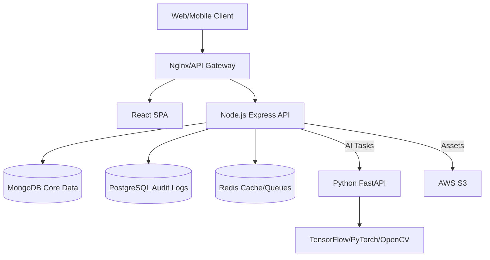

# Architecture

HUMANEXA uses a modern microservices architecture, composed of a robust backend API, a dynamic React frontend, and a specialized Python AI worker for advanced verification tasks.

## High-Level System Architecture



## Folder Structure

```text
/humanexa
  ├── frontend/          # React SPA (Vite, Tailwind, Redux)
  ├── backend/           # Node.js Express API (TypeScript, Zod, BullMQ)
  ├── ai_service/        # Python FastAPI Worker (TensorFlow, OpenCV)
  ├── infrastructure/    # Docker, CI/CD, Nginx Configurations
  └── docs/              # You are here!
```

## Tech Stack
* **Frontend**: React 18, TypeScript, Vite, Tailwind CSS
* **Backend**: Node.js, Express, TypeScript, MongoDB, Redis, PostgreSQL
* **AI Service**: Python 3.10+, FastAPI, PyTorch, OpenCV
* **Infrastructure**: Docker, AWS (S3, SES)
